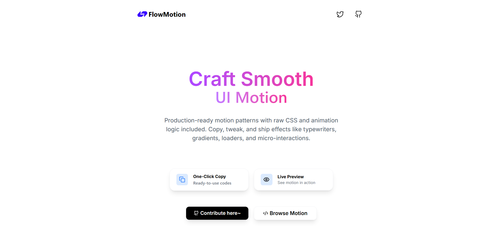

<div align="center">

# ⚡ FlowMotion

**Production-ready UI animations. Copy. Paste. Ship.**

[](https://github.com/piratesofsi/flowmotion/stargazers)
[](https://github.com/piratesofsi/flowmotion/network/members)
[](https://github.com/piratesofsi/flowmotion/pulls)
[](LICENSE)

<br />



<br />

**[flowmotion-liard.vercel.app](https://flowmotion-liard.vercel.app)**

</div>

---

## What is FlowMotion?

Stop writing animation CSS from scratch. FlowMotion is an open-source library of production-ready UI animations — loaders, buttons, text effects, and transitions — with live previews and one-click copy.

Find it. Preview it. Copy it. Done.

---

## Features

| | |
|---|---|
| 🔍 **Search** | Find any animation by name instantly |
| 🏷️ **Category Filter** | Browse Loaders, Buttons, Text, Transitions |
| 👁️ **Live Preview** | See every animation before you copy |
| 📋 **One-Click Copy** | Grab raw CSS or JSX in one click |
| 🎨 **Code Drawer** | Full code view with syntax highlighting |
| 🌍 **Open Source** | Add your own animations via PR |

---

## Running Locally

```bash
git clone https://github.com/piratesofsi/flowmotion.git
cd flowmotion
npm install
npm run dev
```

---

## Project Structure

```
src/
├── components/
│   ├── AnimationCard.jsx     # card UI with hover overlay
│   ├── AnimationDrawer.jsx   # slide-in code drawer
│   ├── LibrarySection.jsx    # grid, search & filter logic
│   ├── HeroSection.jsx       # landing hero
│   └── Navbar.jsx
│
└── data/
    └── animations.jsx        # ← ALL animation data lives here
```

---

## Contributing

Want to add an animation? You only need to touch **one file**: `src/data/animations.jsx`

### Add your animation object

```jsx
{
  id: "my-animation",        // unique kebab-case id
  title: "My Animation",     // name shown on the card
  category: "Loader",        // Loader | Button | Text | Transition
  preview: (                 // JSX live preview shown on the card
    <div style={{
      width: 40,
      height: 40,
      borderRadius: "50%",
      background: "#9333ea",
      animation: "myAnim 1s infinite"
    }} />
  ),
  cssCode: `.my-animation {
  width: 40px;
  height: 40px;
  border-radius: 50%;
  background: #9333ea;
  animation: myAnim 1s infinite;
}

@keyframes myAnim {
  /* your keyframes */
}`,
  jsCode: `// optional React version
const MyAnimation = () => <div className="..." />;`,
}
```

### Steps

```
1. Fork this repo
2. Add your object to src/data/animations.jsx
3. Run npm run dev — make sure the preview renders
4. Open a PR titled: feat: add [animation name]
```

### Rules

- Preview must actually animate — no static elements
- CSS must include `@keyframes` if needed
- No external libraries or dependencies
- `id` must be unique and in `kebab-case`

---

## Tech Stack


---

## License

MIT — use it however you want, personal or commercial.

---

<div align="center">

If FlowMotion saved you time, a ⭐ goes a long way.

</div>